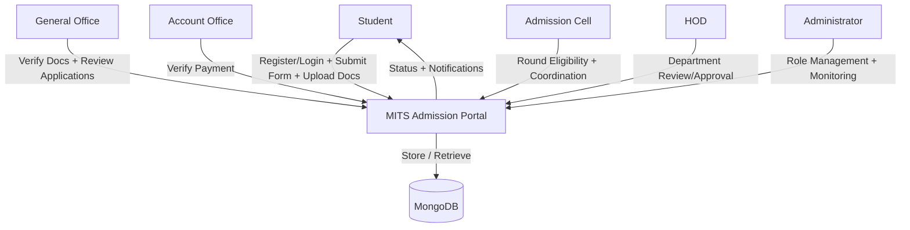
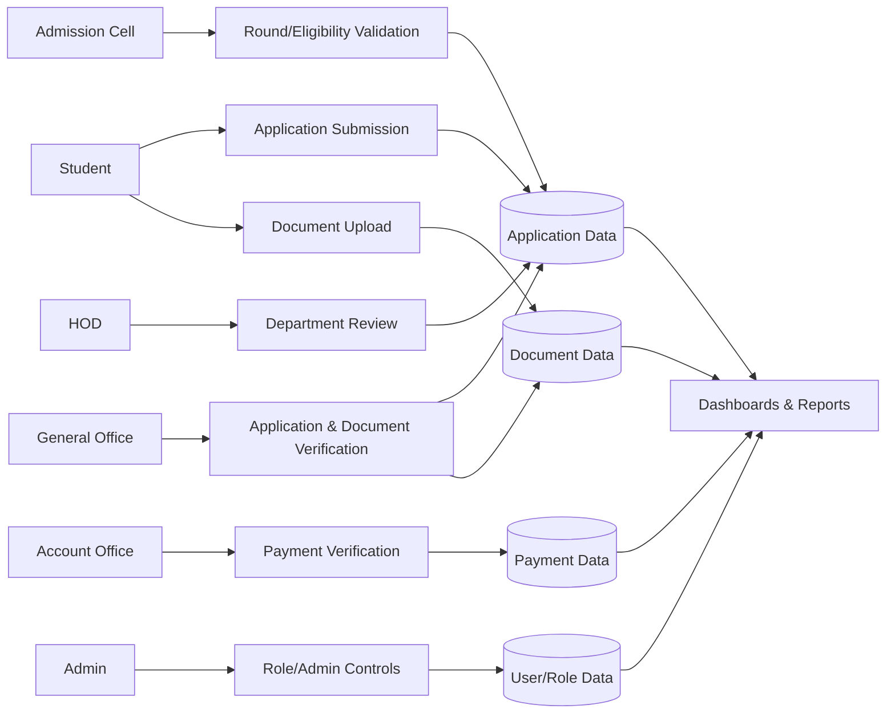

# PROJECT REPORT

## Front Page

**Institute Name:** Madhav Institute of Technology and Science (MITS), Gwalior  
**Department:** ___________________________  
**Program / Project Title:** MITS Admission Portal (Complete System)  

**Submitted By**  
- **Enrollment No.:** ___________________________  
- **Name:** ___________________________  
- **Branch:** ___________________________  

**Submitted To:** ___________________________  
**Session:** 2025-26  
**Date of Submission:** ___________________________  

---

## Index Page

1. Introduction  
2. Objectives  
3. Project / Program Title  
4. Working Status (Complete MITS Portal)  
5. Workflow (End-to-End)  
6. Dataset / Data Model Used  
7. GitHub Link  
8. Screenshots of Web Work (with Date & Time visible)  
9. Source Code (Pasted)  
10. DFD (Data Flow Diagram)  
11. Conclusion  

---

## 1. Introduction

This project implements a **complete MITS Admission Portal** for handling online admission activities across all stakeholder roles. It is a full-stack system that supports application submission, verification, payment checks, approval workflow, and administrative reporting.

The system includes the following modules:

- Authentication module (Google OAuth + JWT)
- Student module
- Admission Cell module
- General Office module
- Account Office module
- HOD module
- Admin module

Technology stack:

- **Frontend:** Next.js (React + TypeScript)
- **Backend:** Node.js + Express
- **Database:** MongoDB with Mongoose

---

## 2. Objectives

- To digitize the complete admission workflow at MITS.
- To provide secure role-based access for all admission stakeholders.
- To reduce manual paperwork and status ambiguity.
- To track application, document, and payment progress in real time.
- To provide analytics/reporting for decision-making.
- To maintain centralized and consistent admission data.

---

## 3. Project / Program Title

**MITS Admission Portal (Complete System)**

---

## 4. Working Status (Complete MITS Portal)

**Current status:** Core modules implemented and integrated; UI refinements and final deployment steps ongoing.

### Implemented Modules

1. **Authentication**
   - Google login endpoint
   - JWT verification
   - logout and current-user endpoint

2. **Student Module**
   - application form handling
   - document uploads
   - status visibility

3. **Admission Cell Module**
   - round and candidate operations
   - eligibility flow integration

4. **General Office Module**
   - dashboard, process tracker, reports, application review

5. **Account Office Module**
   - payment verification workflow

6. **HOD Module**
   - department-level application actions

7. **Admin Module**
   - role and system-level administration
   - operational controls and monitoring

### Pending / Enhancement Scope

- Final UI parity and page-level polishing
- End-to-end testing and QA pass
- Production deployment and hardening
- Additional export/report formats

---

## 5. Workflow (End-to-End)

1. Student authenticates and submits application data.
2. Student uploads required documents.
3. Admission Cell verifies round/eligibility context.
4. General Office performs document/application verification.
5. Account Office validates payment details/status.
6. HOD/Admission stakeholders perform final departmental checks.
7. Admin oversees configuration, roles, and exception handling.
8. Portal updates final status and exposes reports/analytics.

---

## 6. Dataset / Data Model Used

MongoDB collections/models used across the portal include:

- `User`
- `RoleAssignment`
- `Application`
- `Document`
- `Payment`
- `StudentList`
- `AdmissionRound`
- `RoundCandidate`
- `RoundMismatchAttempt`
- `AuditLog`
- `RateLimitHit`

### `Application` Model (Representative Field Groups)

- Personal details: `fullName`, `dateOfBirth`, `gender`, `email`, `phone`, address fields
- Academic details: `programApplied`, `branch`, marks, board, passing year, entrance exam fields
- Workflow status: `draft`, `submitted`, `under_review`, `documents_pending`, `payment_pending`, `admitted`, etc.
- Progress bar state: form/doc/payment/admission stage booleans
- Staff action metadata: remarks, reviewer info, timestamps

---

## 7. GitHub Link

**Repository Link:** https://github.com/__________________/__________________

(Replace with your actual repository link.)

---

## 8. Screenshots of Web Work (Date & Time must be visible)

> Important: Capture screenshots with **system date and time visible** (taskbar/top bar), then paste below.

### 8.1 Public / Entry Screens

- Landing page  
- Login page

### 8.2 Student Module Screens

- Student dashboard
- Application form
- Document upload page
- Student status page

### 8.3 General Office Screens

- Dashboard
- Process Tracker
- Reports
- All Applications
- Application Detail

### 8.4 Admission Cell / Account Office / HOD Screens

- Admission Cell workflow screen
- Account Office verification screen
- HOD review/decision screen

### 8.5 Admin Screens

- Admin dashboard / controls
- User or role management view

---

## 9. Source Code (Pasted)

### 9.1 Backend App Entry (all MITS modules wired)

```js
import express from "express";
import 'dotenv/config'
import cors from "cors";
import cookieParser from "cookie-parser";
import path from "path";

import { main } from "./Services/Connections/db.connection.js";
import { errorHandler, notFoundHandler } from "./middlewares/error.middleware.js";
import { simpleRateLimit } from "./middlewares/rateLimit.middleware.js";

import authRoutes from "./Routes/Authentication/auth.routes.js";
import studentRoutes from "./Routes/Students/student.routes.js";
import admissionCellRoutes from "./Routes/Admission_Cell/admissionCell.routes.js";
import generalOfficeRoutes from "./Routes/General_Office/generalOffice.routes.js";
import accountOfficeRoutes from "./Routes/Account_Office/accountOffice.routes.js";
import hodRoutes from "./Routes/Hod/hod.routes.js";
import adminRoutes from "./Routes/Admin/admin.routes.js";

const app = express();

app.use("/api/auth", authRoutes);
app.use("/api/student", studentRoutes);
app.use("/api/admission-cell", admissionCellRoutes);
app.use("/api/general-office", generalOfficeRoutes);
app.use("/api/account-office", accountOfficeRoutes);
app.use("/api/hod", hodRoutes);
app.use("/api/admin", adminRoutes);

app.use(notFoundHandler);
app.use(errorHandler);
```

### 9.2 Authentication Route (Google + JWT)

```js
import { Router } from "express";
import { getMe, googleLogin, logout } from "../../controllers/auth.controller.js";
import { verifyJWT } from "../../middlewares/auth.middleware.js";

const router = Router();

router.post("/google", googleLogin);
router.post("/logout", logout);
router.get("/me", verifyJWT, getMe);

export default router;
```

### 9.3 Frontend Root Layout (Global App Shell)

```tsx
import "./globals.css";
import { Inter, Montserrat, Poppins } from "next/font/google";
import ClientProviders from "../components/layout/ClientProviders";

export default function RootLayout({ children }: { children: React.ReactNode }) {
  return (
    <html lang="en" className="scroll-smooth">
      <body>
        <ClientProviders>{children}</ClientProviders>
      </body>
    </html>
  );
}
```

### 9.4 Application Model (System-wide Core Dataset)

```js
import mongoose from "mongoose";

const applicationSchema = new mongoose.Schema(
  {
    student: { type: mongoose.Schema.Types.ObjectId, ref: "User", required: true, unique: true },
    fullName: { type: String, trim: true, default: "" },
    email: { type: String, trim: true, lowercase: true, default: "" },
    programApplied: { type: String, trim: true, default: "" },
    branch: { type: String, default: "" },
    status: { type: String, default: "draft" },
    progressBar: {
      formFilled: { type: Boolean, default: false },
      documentsUploaded: { type: Boolean, default: false },
      documentsVerified: { type: Boolean, default: false },
      paymentDone: { type: Boolean, default: false },
      admissionConfirmed: { type: Boolean, default: false },
    },
  },
  { timestamps: true }
);

export default mongoose.model("Application", applicationSchema);
```

---

## 10. DFD (Data Flow Diagram)

### 10.1 Context-Level DFD (Complete MITS Portal)



### 10.2 Level-1 DFD (Module-wise)



---

## 11. Conclusion

The **MITS Admission Portal** has been developed as a complete role-based admission management platform. It covers the entire lifecycle from student registration and application submission to verification, payment processing, departmental checks, and final decision support through dashboards/reports.

The implemented architecture is modular, scalable, and suitable for further enhancements such as production deployment, advanced analytics, and automation.

---

### Submission Checklist

- [ ] Enrollment, Name, Branch filled on front page  
- [ ] GitHub link updated  
- [ ] Screenshots pasted with **date/time visible**  
- [ ] Source code section reviewed  
- [ ] DFD verified  
